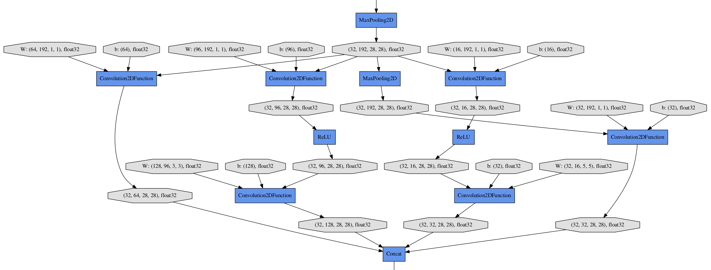

Visualization of Computational Graph
====================================

.. module:: chainer.computational_graph

As neural networks get larger and complicated, it gets much harder to confirm if their architectures are constructed properly.
Chainer supports visualization of computational graphs.
Users can generate computational graphs by invoking :meth:`build_computational_graph`. Generated computational graphs are dumped to specified format (Currently `Dot Language <https://en.wikipedia.org/wiki/DOT_(graph_description_language)>`_ is supported).

Basic usage is as follows::

    import chainer.computational_graph as c
    ...
    g = c.build_computational_graph(vs)
    with open('path/to/output/file', 'w') as o:
        o.write(g.dump())

where ``vs`` is list of :class:`Variable` instances and ``g`` is an instance of :class:`ComputationalGraph`.
This code generates the computational graph that are backward-reachable (i.e. reachable by repetition of steps backward) from at least one of ``vs``.

Here is an example of (a part of) the generated graph (inception(3a) in `GoogLeNet <http://arxiv.org/abs/1409.4842>`_). This example is from ``example/imagenet``.

.. autofunction:: build_computational_graph

.. autoclass:: ComputationalGraph
   :members:
